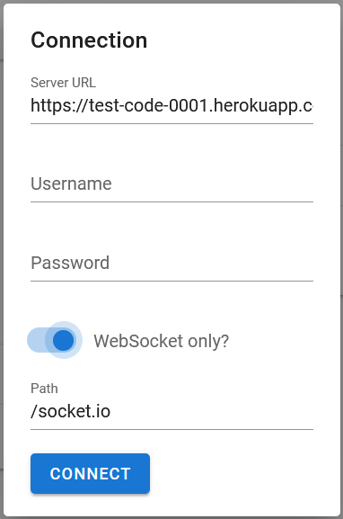
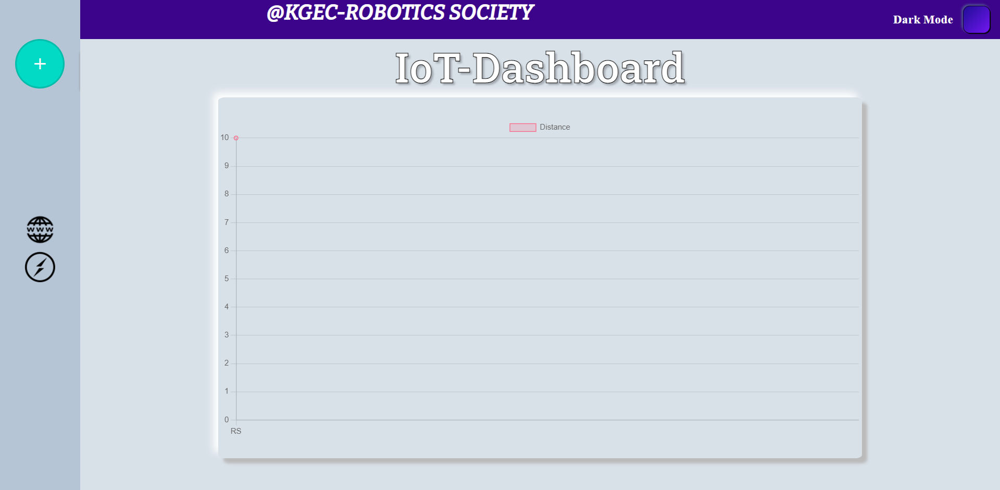
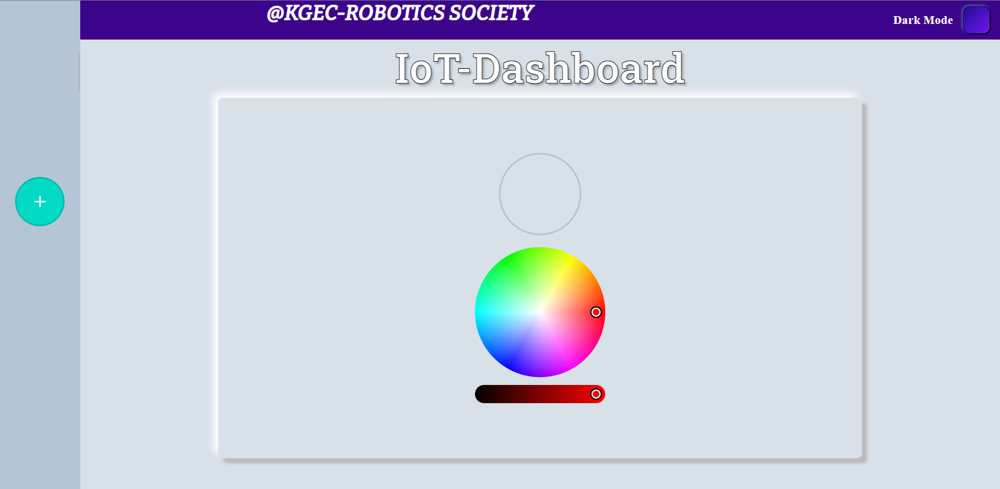
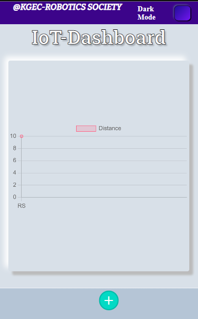
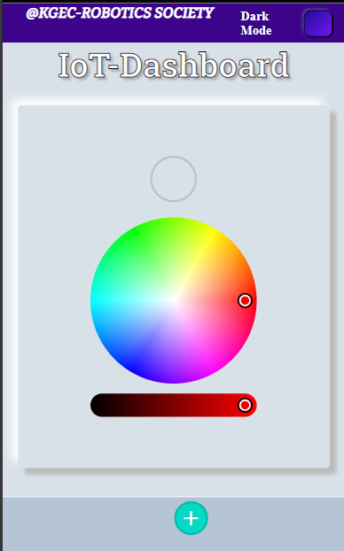

# **IoT-Socket-Server**
This is a demo project based on socket.io and express under KGEC-Robotics-Society.

For IoT code, visit [IoT-Distance-Socket](https://github.com/PSR0001/IoT-Distance-Socket). 

For IoT code, visit [IoT-RGB-Socket](https://github.com/PSR0001/IoT-RGB-Socket).


## **Contents**
1. [Description](#description)
0. [Installation](#installation)
0. [Languages](#languages)
0. [Contribution](#contribution)

## **Description**

### **What is Socket.io?**
 
 Socket.IO is a library that enables real-time, bidirectional and event-based communication between the browser and the server. It consists of:

 - a Node.js server:
 - a Javascript client library for the browser (which can be also run from Node.js):


### **How does that work ?**
 More info About [Socket.io](https://socket.io/docs/v4/) 


### **Why Socket.io ?**
It is a tool to implement realtime communication between server and clients very conveniently, without the clients needing to send multiple requests to the server.

  

### **Why Express ?**
[**Express**](https://expressjs.com/) is the most popular Node web framework, and is the underlying library for a number of other popular [**Node web frameworks**](https://expressjs.com/en/resources/frameworks.html). It provides mechanisms to:

- Write handlers for requests with different HTTP verbs at different URL paths (routes).
- Integrate with "view" rendering engines in order to generate responses by inserting data into templates.
- Set common web application settings like the port to use for connecting, and the location of templates that are used for rendering the response.
- Add additional request processing "middleware" at any point within the request handling pipeline.

we are using **Express** for ```http``` request , Serving the Webpages.

### How this Project will Help Us?
This project will help node.js developers to start making APIs and implementing sockets as well as provide an insight to the working of a basic IoT system.

For the **NodeMCU/ ESP8266** source code, visit 

- [IoT-Distance-Socket](https://github.com/PSR0001/IoT-Distance-Socket). 
- [IoT-RGB-Socket](https://github.com/PSR0001/IoT-RGB-Socket).

## **Installation**
   ### Softeares Required :
   * [visual Studio Code](https://code.visualstudio.com/download)
   * [Node.js](https://nodejs.org/en/)

## **Libraries :**
 
 * [Express](https://expressjs.com/en/starter/hello-world.html)
 * [Socket.io](https://socket.io/docs/v4/)

_Just install nodeJS & VS Code, open the repository on VS code and start working._

### Start the Server :
#### For deployment:
```
npm start
```
#### For deployment:
```
npm run dev
```

## **Languages**

- 
<br>


## **Admin UI**
Go to this URL: https://admin.socket.io and put ```test-code-0001.herokuapp.com/admin``` in the Server URL. Note that the domain ```test-code-0001.herokuapp.com``` is just for the demonstration, if you are running this project locally, replace that URL with ```localhost:PORT``` where PORT is the same ```PORT``` that your server is running on

It should look something like this:


<!--  -->
<br>
<br>

## **Projects Picture :**




<br>
 

<br>

## **Contribution**
This is a concept for beginners starting with IoT. Feel free to fork, clone, create issues and/or make PRs. We will be more than happy to receive your contributions.


